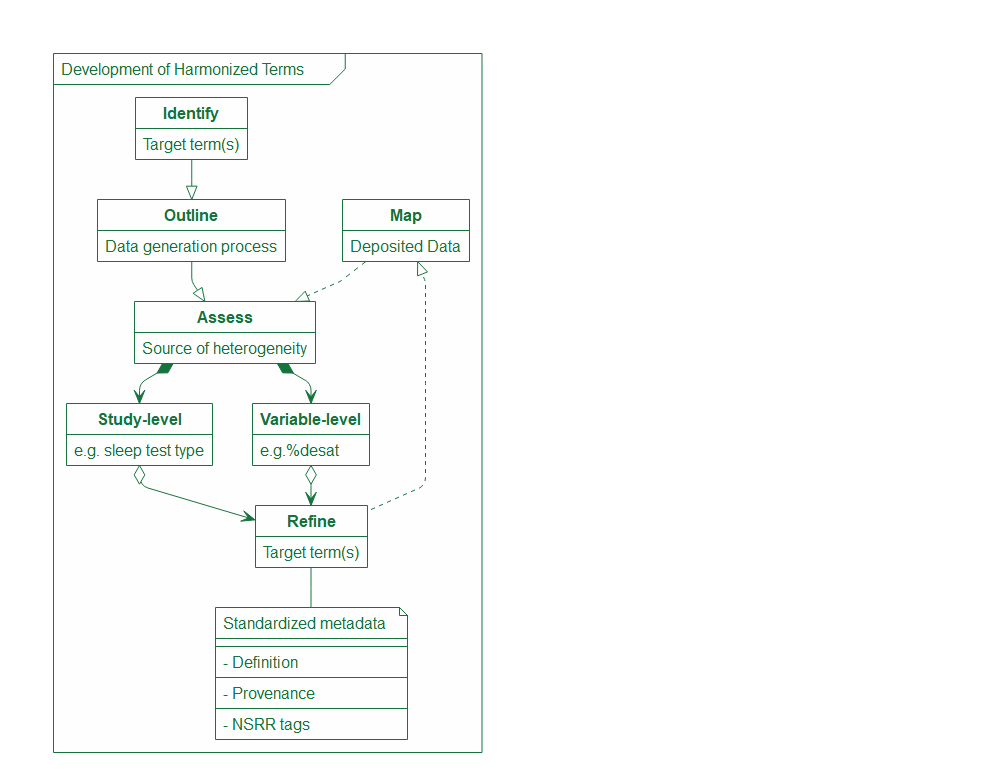
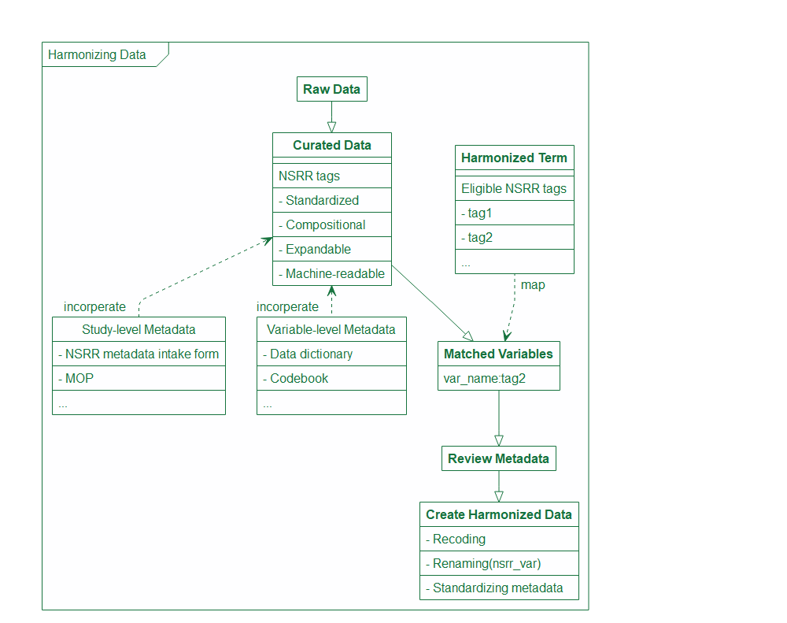
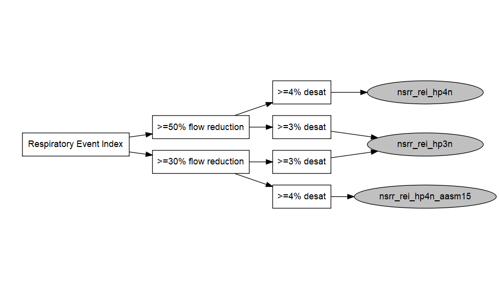
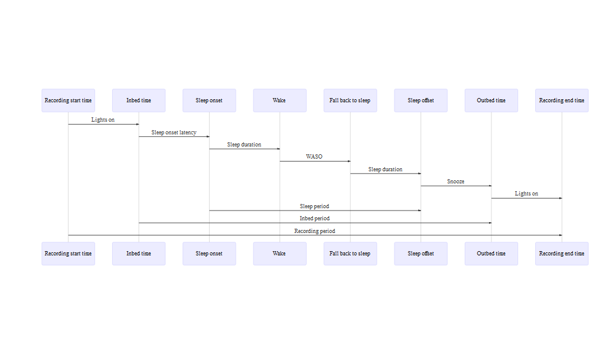

An introduction to the NSRR harmonized variable documentation
================
Ying Zhang
26 December, 2022

This repository contains documentation for the selected phenotype, sleep monitoring (e.g. polysomnography, polygraphy, actigraphy) and survey questionnaire data harmonized by the [National Sleep Research Resource
(NSRR)](https://www.sleepdata.org/).The documentation includes harmonization standards, rationale, and scripts for recreating the harmonized data.

## Repository contents

| file                   | description                                                                                        |
|------------------------|----------------------------------------------------------------------------------------------------|
| `non-sleep-phenotype/` | Documentation for harmonized non-sleep covariates.                                                 |
| `sleep-monitoring/`    | Documentation and scripts for harmonizing sleep study data.                                        |
| `sleep-questionnaire/` | Documentation and scripts for harmonizing sleep questionnaire data.                                |
| `README.md`            | This document.                                                                                     |
| `README.Rmd`           | Source for this document.                                                                          |

**Table of Contents**

- [Overview](#overview)

- [Non-Sleep Phenotype Data](#non-sleep-phenotype-data)

- [Polysomnography and Polygraphy
  Data](#polysomnography-and-polygraphy-data)

- [Sleep Questionnaire Data](#sleep-questionnaire-data)

- [Resources](#resources)

------------------------------------------------------------------------

## Overview

The objectives for data harmonization is (1) to identify core sleep-related
terms that are semantically similar, (2) to assess heterogeneity in study-level
and variable-level metadata, (3) to improve comparability of the harmonized terms,
and (4) to ensure harmonized terms are inferentially equivalent when possible. 
We identified three data types on the NSRR website that are most valuable harmonization
- Commonly used non-sleep covariates
- Sleep monitoring data (e.g.,polysomnography/polygraphy)
- Sleep questionnaire data.
A domain-specific approach has been developed for each data type to address harmonization challenges. 
The harmonized data are created using SAS and saved as separate files within each NSRR dataset. 
All SAS scripts are publicly available on  [github.com/nsrr](https://github.com/nsrr).

*Note*: The current harmonization process is primarily rule-based rather than data-driven. Future efforts will focus on evaluating the consistency of harmonized data across demographically similar datasets.

## Non-Sleep Phenotype Data

[TOPMed DCC’s harmonized
phenotype](https://github.com/UW-GAC/topmed-dcc-harmonized-phenotypes)
and [BioDataCatalyst Common Data
Model](https://github.com/uc-cdis/gtex-dictionary/tree/master/gdcdictionary/schemas/)
were identified as the harmonization standards for the non-sleep
phenotype data. We have harmonized 9 non-sleep phenotype variables:

- Age(`nsrr_age`)
- Sex(`nsrr_sex`)
- Race(`nsrr_race`)
- Ethnicity(`nsrr_ethnicity`)
- Body mass index(`nsrr_bmi`)
- Current smoker(`nsrr_current_smoker`)
- Ever smoker(`nsrr_ever_smoker`)
- Resting systolic(`nsrr_bp_systolic`)
- Diastolic blood pressure(`nsrr_bp_diastolic`)

### Data format

- Numeric variables retain their original format.
- Categorical variables (e.g., sex, race) are recoded as strings.
- All permissible values for harmonized categorical variables are provided as JSON files in  `non-sleep-phenotype/`.

### Missing value

- For numeric variables, missing values are represented as empty cells.
- For categorical variables, explicit missing codes are used in line with the TOPMed/BioDataCatalyst standards.
- Non-specific missing values are generally coded as `“not reported”`.

## Polysomnography and Polygraphy Data

Retrospective polysomnography/Polygraph (PSG) data harmonization focuses
on summary PSG data submitted by the data owners, which was either
manually scored by scorers or automatically scored by the device.
Prospective PSG data harmonization using EDF files can be done by the
NSRR [NAP pipeline](https://zzz.bwh.harvard.edu/luna/nap/). 

### Iterative Harmonization Process
The NSRR tags streamline harmonization by allowing curated data to be mapped to harmonized variables through a compositional coding scheme. When tags match eligible harmonized terms, we conduct a detailed metadata review and generate the harmonized variable.
As illustrated in the process diagram down below, we took an iterative
approach when developing harmonized summary PSG terms. We first
identified the initial target terms (e.g., AHI3%, AHI4%, total sleep
duration, overall arousal index and sleep/wake signal quality flag).
Then we mapped out the key steps in the PSG data generation process
which tend to be the major sources of heterogeneity. After identifying
all the varying components in the study-level and variable-level
metadata that greatly affect the comparability of PSG data, we went back
to the initial target terms and decided whether (and how) we would need
to modify and expand the target terms to accommodate all the
heterogeneity. We then mapped the deposited data at the NSRR to the
refined target terms and assessed if there were any additional sources
of heterogeneity that should be accounted for. We also standardized the
metadata for the target terms during the process which includes
harmonized term definitions, provenance information (how to document the
source data and any processing of the source data), as well as the
standardized NSRR tags for “forward-compatible” harmonization.

<!-- -->

Using the NSRR tags, we are able to leverage data/metadata curation that
we do routinely at NSRR to quickly map and create new harmonized data.
As shown in the diagram down below, once the raw data is curated and
assigned a NSRR tag based on a compositional coding scheme we developed
at NSRR, we can simply search if any of the eligible tags listed by the
harmonized term(s) metadata is present in the new dataset. Once there is
a match, we will conduct an in-depth review of all the associated
metadata to make sure the harmonized term(s) are mapped correctly, and
create a harmonized version with new variable name and metadata once the
mapping is confirmed.

<!-- -->

### Apnea-hypopnea Indices

After carefully evaluating the main sources of heterogeneity in PSG data
generation and processing across datasets, we’ve identified four varying
components in the metadata:
- Sleep test type (i.e., type I or II polysomnography, type III or IV polygraphy/home sleep apnea test)
- Flow reduction criteria
- Oxygen desaturation threshold
- Arousals

The commonly referenced AHI3% and AHI4% vary across these dimensions, resulting in multiple permutations.

<!-- --> Among the 13
permutations of AHI3% and AHI4% as illustrated in the diagram above,
we’ve mapped a subset of them to the American Academy of Sleep Medicine
(AASM) Clinical Guidelines and consolidated into 10 harmonized
variables - 7 AHIs and 3 REIs.

| Year | Version     | Definition for Hypopnea Events                                                                     | Event Duration | Reduction Duration Criteria  | Consolidated Coding |
|------|-------------|----------------------------------------------------------------------------------------------------|----------------|------------------------------|---------------------|
| 1999 |             | \>50% nasal cannula reduction or discernible nasal cannula reduction with (\>=3% desat or arousal) | \>=10 sec      |                              | chicago1999         |
| 2007 | Recommended | \>=30% nasal cannula \[or alternative sensor\] reduction with \>=4% desat                          | \>=10 sec      | \>=90% of the event duration | same as hp4u_aasm15 |
| 2007 | Alternative | \>=50% nasal cannula \[or alternative sensor\] reduction with (\>=3% desat or arousal)             | \>=10 sec      | \>=90% of the event duration | hp3r_aasm07         |
| 2012 | Recommended | \>=30% nasal cannula \[or alternative sensor\] reduction with (\>=3% desat or arousal)             | \>=10 sec      | \>=10 sec                    | same as hp3r_aasm15 |
| 2012 | Alternative | \>=30% nasal cannula \[or alternative sensor\] reduction with \>=4% desat                          | \>=10 sec      | \>=10 sec                    | same as hp4u_aasm15 |
| 2015 | Recommended | \>=30% nasal cannula \[or alternative sensor\] reduction with (\>=3% desat or arousal)             | \>=10 sec      | \>=10 sec                    | hp3r_aasm15         |
| 2015 | Acceptable  | \>=30% nasal cannula \[or alternative sensor\] reduction with (\>=4% desat)                        | \>=10 sec      | \>=10 sec                    | hp4u_aasm15         |

<!-- -->

<!-- -->

Harmonized AHI/REI terms are shown in grey circles in the diagram above,
and can be searched on the NSRR website. Links to the source variables
are available in the metadata.

| Harmonized terms     | Eligible NSRR tags                                                                 |
|----------------------|------------------------------------------------------------------------------------|
| nsrr_ahi_hp3u        | ahi_ap0uhp5x3u_f1t1, ahi_ap0uhp5x3u_f1t2, ahi_ap0uhp3x3u_f1t1, ahi_ap0uhp3x3u_f1t2 |
| nsrr_ahi_hp3r_aasm07 | ahi_ap0uhp5x3r_f1t1, ahi_ap0uhp5x3r_f1t2                                           |
| nsrr_ahi_hp3r_aasm15 | ahi_ap0uhp3x3r_f1t1, ahi_ap0uhp3x3r_f1t2                                           |
| nsrr_ahi_hp4u        | ahi_ap0uhp5x4u_f1t1, ahi_ap0uhp5x4u_f1t2                                           |
| nsrr_ahi_hp4u_aasm15 | ahi_ap0uhp3x4u_f1t1, ahi_ap0uhp3x4u_f1t2                                           |
| nsrr_ahi_hp4r        | ahi_ap0uhp5x4r_f1t1,ahi_ap0uhp5x4r_f1t2, ahi_ap0uhp3x4r_f1t1, ahi_ap0uhp3x4r_f1t2  |
| nsrr_ahi_chicago1999 | ahi_ap0uhp5x0u_ap0uhp0x3r_f1t1, ahi_ap0uhp5x0u_ap0uhp0x3r_f1t2                     |
| nsrr_rei_hp4n        | rei_ap0nhp5x4n_f1t3, rei_ap0nhp5x4n_f1t4                                           |
| nsrr_rei_hp4n_aasm15 | rei_ap0nhp3x4n_f1t3, rei_ap0nhp3x4n_f1t4                                           |
| nsrr_rei_hp3n        | rei_ap0nhp5x3n_f1t3, rei_ap0nhp5x3n_f1t4, rei_ap0nhp3x3n_f1t3, rei_ap0nhp3x3n_f1t4 |

### Total Sleep Duration

The terms to describe time intervals versus points of time are one of
the major sources of confusion and ambiguity in PSG sleep architecture
metadata. Depending on the context and usage, “time” might refer to a
specific point in time or to an interval between two time points (e.g.,
study start time versus total sleep time), while “duration” and “period”
could both be taken to correspond to intervals, they were often used
interchangeably in protocol descriptions and data dictionaries without
any indication of whether they referred to intervals between designated
time points or to specific intervals when subjects were determined to be
awake or asleep. Therefore, we’ve developed a set of standardized terms
to address the challenges of “time”, “period”, “duration” being used
inconsistently at the NSRR metadata documentation internally.

<!-- -->

Total sleep duration (i.e., total sleep time) is defined as the interval
between sleep onset and offset while the subject was asleep, which is an
important measure used in calculating various indices. Among studies
with type I/II polysomnography data, we’ve mapped all total sleep
duration and created a harmonized variable `nsrr_ttldursp_f1` in which
`f1` refers to the source of data (i.e.,f1=polysomnography/polygraphy,
f2=actigraphy, f3=sleep questionnaire).

| Harmonized terms | Eligible NSRR tags                          |
|------------------|---------------------------------------------|
| nsrr_ttldursp_f1 | ttldursp_f1t1, ttldursp_f1t2, ttldursp_f1t3 |

### Overall Arousal Index

Overall arousal index is defined as the total number of arousal divided
by the total sleep duration (i.e., total sleep time). We’ve mapped all
overall arousal index from datasets with type I/II polysomnography and
created a harmonized variable `nsrr_phrnumar_f1`.

| Harmonized terms | Eligible NSRR tags           |
|------------------|------------------------------|
| nsrr_phrnumar_f1 | phrnumar_f1t1, phrnumar_f1t2 |

### Sleep/Wake Signal Quality Flag

We’ve selected sleep/wake signal quality flag for it’s commonly
misunderstood and misused by the NSRR users. When the EEG is
insufficient in quality to allow distinction of sleep stages, all sleep
stages were scored using a default of “Stage 2” and no arousal was
scored. Studies and individuals with “sleep/wake only” instead of “full
scoring” for `nsrr_flag_spsw` should not be used to analyze sleep
architecture or arousals.

## Sleep Questionnaire Data
