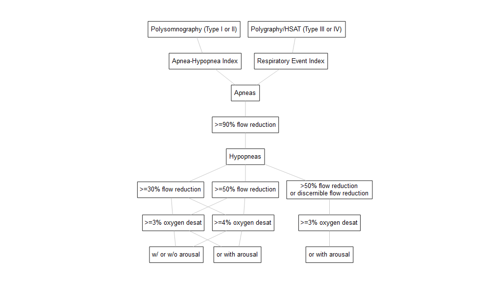
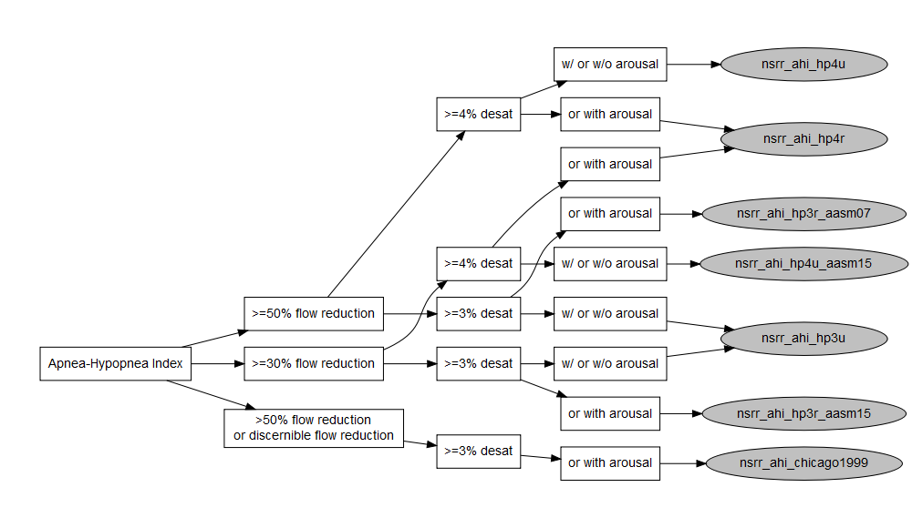

Introduction to NSRR Harmonized Variable Documentation
================
Ying Zhang, Ph.D.

This repository contains documentation for the phenotype, sleep
monitoring (e.g. polysomnography, polygraphy, actigraphy) and survey
questionnaire data harmonized by the [National Sleep Research Resource
(NSRR)](https://www.sleepdata.org/), including harmonization standards,
rationale, and script for recreating the harmonized data.

## Repository Contents

| file                   | description                                                                                        |
|------------------------|----------------------------------------------------------------------------------------------------|
| `non-sleep-phenotype/` | A directory containing documentations for harmonized non-sleep covariates.                         |
| `sleep-monitoring/`    | A directory containing documentations and script for creating harmonized sleep monitoring data.    |
| `sleep-questionnaire/` | A directory containing documentations and script for creating harmonized sleep questionnaire data. |
| `README.md`            | This document.                                                                                     |
| `README.Rmd`           | Source for this document.                                                                          |

**Table of Contents**

- [Overview](#overview)

- [Non-Sleep Phenotype Data](#non-sleep-phenotype-data)

- [Polysomnography and Polygraphy
  Data](#polysomnography-and-polygraphy-data)

- [Sleep Questionnaire Data](#sleep-questionnaire-data)

- [Resources](#resources)

------------------------------------------------------------------------

## Overview

The objectives of NSRR data harmonization are to (1) identify semantically equivalent core sleep terms, (2) assess heterogeneity in study-level and variable-level metadata, (3) improve cross-study comparability of derived variables, and (4) promote inferential equivalence across datasets when feasible. 
NSRR has identified three categories of data shared on the NSRR website that are most likely to benefit users when harmonized: commonly used non-sleep covariates, sleep monitoring data (e.g., polysomnography and polygraphy), and sleep questionnaire data.
Domain-specific harmonization approaches have been developed to address the unique methodological and metadata challenges associated with each data type.
Harmonized variables were generated using SAS and R, and distributed as separate derived data files within each NSRR dataset. All SAS scripts are publicly available
on [github.com/nsrr](https://github.com/nsrr).

The current harmonization process is expert-driven rather than data-driven; however, NSRR plans to assess the similarity of harmonized variables across demographically comparable datasets in future work.

## Non-Sleep Phenotype Data

[TOPMed DCC’s harmonized
phenotype](https://github.com/UW-GAC/topmed-dcc-harmonized-phenotypes)
and [BioDataCatalyst Common Data
Model](https://github.com/uc-cdis/gtex-dictionary/tree/master/gdcdictionary/schemas/)
were identified as the harmonization standards for the non-sleep
phenotype data. We have harmonized 9 non-sleep phenotype variables:
age(`nsrr_age`), sex(`nsrr_sex`), race(`nsrr_race`),
ethnicity(`nsrr_ethnicity`), body mass index(`nsrr_bmi`), current
smoker(`nsrr_current_smoker`), ever smoker(`nsrr_ever_smoker`), resting
systolic(`nsrr_bp_systolic`) and diastolic blood
pressure(`nsrr_bp_diastolic`).

### Data Format

Original data formats were preserved for numeric variables. Categorical variables (e.g., sex, race) were recoded as character strings. All
permissible values for the harmonized categorical variables are
available as JSON files in `non-sleep-phenotype/`.

### Missing Value

For numerical variables, missing values were represented as empty cell
in the date files. For categorical variables, explicit missing
codes were used to comply with the TopMED/BioDataCatalyst harmonization
standards. Unspecific missing was coded as “not reported” for most
categorical variables.

## Polysomnography and Polygraphy Data

Polysomnography (PSG) and polygraphy are commonly used sleep monitoring methods that record multiple physiological signals during sleep, such as airflow, oxygen saturation, respiratory effort, and brain activity (EEG). These data are widely used to derive summary measures of sleep quality and sleep-disordered breathing, including apnea–hypopnea indices (AHI), total sleep time, and arousal indices.

### Types of Harmonized PSG data on NSRR

NSRR currently supports two broad approaches to PSG harmonization:

1. Retrospective harmonization of summary PSG data
This approach focuses on summary variables (e.g., AHI, total sleep time) that were already generated by study investigators. These variables may have been:

    - Manually scored by trained technicians, or

    - Automatically scored by devices or proprietary software

    Most PSG harmonization described in this repository falls into this category.

2. Prospective harmonization of raw PSG signals
For studies that share raw EDF files, NSRR provides the [NAP pipeline](https://zzz.bwh.harvard.edu/luna/nap/),
which enables standardized signal processing using this open-source tool. This approach supports prospective, 
fully reproducible harmonization of PSG signal data but is outside the scope of the current documentation.

### Why PSG Data Harmonization Is Challenging

Although PSG-derived variables often share the same name across studies (e.g., “AHI”), they are not always directly comparable. 
This is because the value of a PSG summary variable depends on multiple methodological decisions made during data collection and scoring.

Key sources of heterogeneity include:

1. Sleep test type
  e.g., in-lab polysomnography versus home sleep apnea test (without EEG)
  
2. Event definitions
  e.g., how respiratory event (especially hypopneas) are defined
  
3. Scoring guidelines
  e.g., which version of American Academy of Sleep Medicine (AASM) guidelines were used
  
Without accounting for these differences, pooling PSG data across studies can lead to misleading results.

### NSRR's harmonization approach for PSG data

NSRR uses an iterative, metadata-driven approach to harmonize PSG summary variables. The process consists of the following steps (as illustrated in the process diagram down below):

1. Identify initial target variables
  Examples include AHI3%, AHI4%, total sleep duration, overall arousal index and sleep/wake signal quality flag

2. Map the PSG generation process  
  Each category of target variables is broken down into the underlying components that influence its value (e.g., sleep test type, signal sources, scoring rules, thresholds, etc.)

3. Identify sources of heterogeneity
  Study-level and variable-level metadata are reviewed to determine which components differ across datasets.
  
4. Refine and expand target variables
  When necessary, new harmonized variables are created to explicitly represent different combinations of scoring rules or physiological criteria, that deemed comparable by in-house expert.
  
5. Map deposited NSRR variables to harmonized definitions
  Source variables are evaluated against harmonized definitions to ensure conceptual and inferential alignment.
  
6. Standardize metadata for each harmonized variable
  This includes: 
    - Clear variable definitions for harmonized term
    - Provenance information (how the variable was derived)
    - Standardized NSRR tags to support future harmonization
  
<!-- -->

### Roles of NSRR tags

NSRR tags provide a structured way to encode key characteristics of PSG variables, such as signal type, event definition, and scoring method. Once a dataset is curated and tagged:

- Eligible source variables can be automatically identified

- Harmonized variables can be generated more efficiently

- New datasets can be evaluated for compatibility with existing harmonized terms

<!-- -->

### NSRR harmonized PSG terms:

#### Apnea-hypopnea Indices

The apnea–hypopnea index (AHI) is one of the most widely used PSG-derived measures, but it is also one of the most heterogeneous.

AHI values can differ depending on:

- The type of sleep study (type I or II PSG vs type III or IV home sleep apnea test)

- The definition of hypopnea (e.g., flow reduction, oxygen desaturation, with arousals or not)

- The scoring guideline used (e.g., AASM 2007 recommended vs 2015 recommended)

NSRR evaluated these dimensions and identified multiple valid permutations of AHI. 
Rather than forcing them into a single variable, NSRR consolidated them into a set of harmonized AHI and respiratory event indices (REI) variables, 
each aligned with specific clinical or guideline-based definitions. These harmonized variables are explicitly documented and searchable on the NSRR website, 
with links to their source variables and metadata.

<!-- --> Among the 13
permutations of AHI3% and AHI4% as illustrated in the diagram above,
we’ve mapped a subset of them to the American Academy of Sleep Medicine
(AASM) Clinical Guidelines and consolidated into 10 harmonized
variables - 7 AHIs and 3 REIs.

| Year | Version     | Definition for Hypopnea Events                                                                     | Event Duration | Reduction Duration Criteria  | Consolidated Coding |
|------|-------------|----------------------------------------------------------------------------------------------------|----------------|------------------------------|---------------------|
| 1999 |             | \>50% nasal cannula reduction or discernible nasal cannula reduction with (\>=3% desat or arousal) | \>=10 sec      |                              | chicago1999         |
| 2007 | Recommended | \>=30% nasal cannula (or alternative sensor) reduction with \>=4% desat                          | \>=10 sec      | \>=90% of the event duration | same as hp4u_aasm15 |
| 2007 | Alternative | \>=50% nasal cannula (or alternative sensor) reduction with (\>=3% desat or arousal)             | \>=10 sec      | \>=90% of the event duration | hp3r_aasm07         |
| 2012 | Recommended | \>=30% nasal cannula (or alternative sensor) reduction with (\>=3% desat or arousal)             | \>=10 sec      | \>=10 sec                    | same as hp3r_aasm15 |
| 2012 | Alternative | \>=30% nasal cannula (or alternative sensor) reduction with \>=4% desat                          | \>=10 sec      | \>=10 sec                    | same as hp4u_aasm15 |
| 2015 | Recommended | \>=30% nasal cannula (or alternative sensor) reduction with (\>=3% desat or arousal)             | \>=10 sec      | \>=10 sec                    | hp3r_aasm15         |
| 2015 | Acceptable  | \>=30% nasal cannula (or alternative sensor) reduction with (\>=4% desat)                        | \>=10 sec      | \>=10 sec                    | hp4u_aasm15         |

<!-- -->

<!-- -->

Harmonized AHI/REI terms are shown in grey circles in the diagram above,
and can be searched on the NSRR website. Links to the source variables
are available in the metadata.

| Harmonized terms       | Eligible NSRR tags                                                                 |
|------------------------|------------------------------------------------------------------------------------|
| `nsrr_ahi_hp3u`        | `ahi_ap0uhp5x3u_f1t1`, `ahi_ap0uhp5x3u_f1t2`, `ahi_ap0uhp3x3u_f1t1`, `ahi_ap0uhp3x3u_f1t2` |
| `nsrr_ahi_hp3r_aasm07` | `ahi_ap0uhp5x3r_f1t1`, `ahi_ap0uhp5x3r_f1t2`                                           |
| `nsrr_ahi_hp3r_aasm15` | `ahi_ap0uhp3x3r_f1t1`, `ahi_ap0uhp3x3r_f1t2`                                           |
| `nsrr_ahi_hp4u`        | `ahi_ap0uhp5x4u_f1t1`, `ahi_ap0uhp5x4u_f1t2`                                           |
| `nsrr_ahi_hp4u_aasm15` | `ahi_ap0uhp3x4u_f1t1`, `ahi_ap0uhp3x4u_f1t2`                                           |
| `nsrr_ahi_hp4r`        | `ahi_ap0uhp5x4r_f1t1`, `ahi_ap0uhp5x4r_f1t2`, `ahi_ap0uhp3x4r_f1t1`, `ahi_ap0uhp3x4r_f1t2`  |
| `nsrr_ahi_chicago1999` | `ahi_ap0uhp5x0u_ap0uhp0x3r_f1t1`, `ahi_ap0uhp5x0u_ap0uhp0x3r_f1t2`                     |
| `nsrr_rei_hp4n`        | `rei_ap0nhp5x4n_f1t3`, `rei_ap0nhp5x4n_f1t4`                                           |
| `nsrr_rei_hp4n_aasm15` | `rei_ap0nhp3x4n_f1t3`, `rei_ap0nhp3x4n_f1t4`                                           |
| `nsrr_rei_hp3n`        | `rei_ap0nhp5x3n_f1t3`, `rei_ap0nhp5x3n_f1t4`, `rei_ap0nhp3x3n_f1t3`, `rei_ap0nhp3x3n_f1t4` |

#### Overall Arousal Index

Overall arousal index is defined as the total number of arousal divided
by the total sleep duration (i.e., total sleep time). Overall arousal index from datasets with type I/II polysomnography were mapped and
a harmonized variable `nsrr_phrnumar_f1` was created.

| Harmonized terms | Eligible NSRR tags           |
|------------------|------------------------------|
| `nsrr_phrnumar_f1` | `phrnumar_f1t1`, `phrnumar_f1t2` |

#### Sleep Architecture 

##### Total Sleep Duration

The terminology used to describe **points in time** versus **time intervals** is a major source of confusion and ambiguity
in PSG sleep architecture metadata. In practice, the term *“time”* may refer either to a specific
temporal point (e.g., recording start time) or to an interval defined by two time points (e.g., total sleep time).
Similarly, the terms *“duration”* and *“period”* are often used to denote intervals, but they have historically been
applied inconsistently in study protocols and data dictionaries. In many cases, these terms are used interchangeably
without clearly specifying whether they represent (1) intervals bounded by defined clock times or (2) intervals
defined by physiological states, such as sleep or wakefulness. This lack of precision complicates interpretation and
limits cross-study comparability. To address these issues, NSRR has developed a set of standardized temporal terms
to enforce consistent and unambiguous usage of *time*, *period*, and *duration* within its internal metadata documentation.

<!-- -->

Total sleep duration (also referred to as *total sleep time*) is defined as the cumulative interval between sleep
onset and sleep offset during which the subject is scored as asleep. This measure is a fundamental component in
the calculation of multiple PSG-derived indices, including apnea–hypopnea and arousal indices. For studies with
type I or type II polysomnography data, NSRR has mapped all eligible total sleep duration variables and generated
a harmonized variable, `nsrr_ttldursp_f1`. For selected datasets with type III HSAT, estimated total sleep duration,
inferred from analysis of non-EEG channels [Zhao et al., 2017 (PMID:27707441)](https://pmc.ncbi.nlm.nih.gov/articles/PMC5181603/)
was used to create the harmonized total sleep duration. 

The suffix `f1` denotes the data source, where `f1` corresponds to PSG or HSAT, `f2` to actigraphy, and `f3` to sleep questionnaire–derived estimates.

| Harmonized terms | Eligible NSRR tags                          |
|------------------|---------------------------------------------|
| `nsrr_ttldursp_f1` | `ttldursp_f1t1`, `ttldursp_f1t2`, `ttldursp_f1t3` |

*Updated: to be consistent with community conventions, we changed the harmonized variable name for total sleep duration to `nsrr_tst_f1`.*

##### Total In-Bed Period

Total in-bed period is defined as the interval between lights-off (or in-bed time) and lights-on (or out-of-bed time).This measure is 
conventionally referred to as time in bed (TIB) and includes both sleep and wake. NSRR has mapped all eligible total in-bed period variables and generated
a harmonized variable, `nsrr_ttlprdbd_f1`. The suffix `f1` denotes the data source, where `f1` corresponds to PSG
or HSAT, `f2` to actigraphy, and `f3` to sleep questionnaire–derived estimates.

| Harmonized terms | Eligible NSRR tags                                         |
|------------------|------------------------------------------------------------|
| `nsrr_ttlprdbd_f1` | `ttlprdbd_f1t1`, `ttlprdbd_f1t2`, `ttlprdbd_f1t3`, `ttlprdbd_f1t4` |

*Updated: to be consistent with community conventions, we changed the harmonized variable name for total in-bed period to `nsrr_tib_f1`.*

##### Sleep Stage Distribution

Sleep stage distribution variables describe the proportion of total sleep duration spent in each sleep stage. Percentages are
calculated relative to total sleep duration (total sleep time, TST, `nsrr_tst_f1`), defined as the cumulative time scored as
sleep between sleep onset and sleep offset.

The following harmonized variables represent stage-specific percentages of total sleep duration:

- `nsrr_pctdursp_s1`: Percentage of total sleep duration spent in stage N1 sleep.

- `nsrr_pctdursp_s2`: Percentage of total sleep duration spent in stage N2 sleep.

- `nsrr_pctdursp_s3`: Percentage of total sleep duration spent in stage N3/N4 sleep.

- `nsrr_pctdursp_sr`: Percentage of total sleep duration spent in rapid eye movement (REM) sleep.

These measures provide standardized summaries of sleep architecture composition and enable comparisons across studies that 
may differ in absolute sleep duration but share compatible staging criteria.

| Harmonized terms     | Eligible NSRR tags                       |
|----------------------|------------------------------------------|
| `nsrr_pctdursp_s1`     | `pctdursp_s1_f1t1`, `pctdursp_s1_f1t2` |
| `nsrr_pctdursp_s2`     | `pctdursp_s2_f1t1`, `pctdursp_s2_f1t2` |
| `nsrr_pctdursp_s3`     | `pctdursp_s3_f1t1`, `pctdursp_s3_f1t2` |
| `nsrr_pctdursp_sr`     | `pctdursp_sr_f1t1`, `pctdursp_sr_f1t2` |

##### Sleep Latency and REM Latency

Latency measures quantify the timing of sleep and REM onset relative to defined reference points. NSRR harmonizes multiple latency 
definitions to preserve distinctions that are often conflated across studies.

- `nsrr_ttllatsp_f1`
    - Sleep Latency: defined as the interval between lights-off (or in-bed time) and sleep onset from PSG.

- `nsrr_ttldursp_s1sr`
    - REM Sleep Latency, excluding wake: defined as the interval between the first epoch of sleep and the onset of REM sleep, excluding intervening wake epochs.

- `nsrr_ttlprdsp_s1sr`
    - REM Sleep Latency, including wake: defined as the interval between the first epoch of sleep and the onset of REM sleep, including intervening wake epochs.

By explicitly distinguishing whether wake is included in the latency interval, NSRR avoids ambiguity that commonly arises in REM latency definitions.

| Harmonized terms     | Eligible NSRR tags                       |
|----------------------|------------------------------------------|
| `nsrr_ttllatsp_f1`     | `ttllatsp_f1t1`, `ttllatsp_f1t2`, `ttllatsp_f1t3` |
| `nsrr_ttldursp_s1sr`   | `ttlprdsp_s1sr_f1t1`, `ttlprdsp_s1sr_f1t2` |
| `nsrr_ttlprdsp_s1sr`   | `ttldursp_s1sr_f1t1`, `ttldursp_s1sr_f1t2` |

##### Sleep Efficiency and Maintenance Measures

Sleep efficiency metrics describe the proportion of time spent asleep within broader temporal windows.

- `nsrr_ttleffsp_f1` 
    - Sleep Efficiency: defined as the ratio of total sleep duration to total in-bed period (TST/TIB).

- `nsrr_ttlmefsp_f1`
    - Sleep Maintenance Efficiency: defined as the proportion of total sleep duration relative to total sleep period, where the sleep period is the interval between sleep onset and sleep offset and includes wake after sleep onset (WASO).

| Harmonized terms     | Eligible NSRR tags                       |
|----------------------|------------------------------------------|
| `nsrr_ttleffsp_f1`     | `ttleffsp_f1t1`, `ttleffsp_f1t2`       |
| `nsrr_ttlmefsp_f1`   | `ttlmefsp_f1t1`, `ttlmefsp_f1t2`         |

##### Wake After Sleep Onset (WASO)

- `nsrr_ttldurws_f1`
    - WASO: defined as the total duration of wake occurring between sleep onset and lights-on (or out-of-bed time). 
  WASO reflects sleep fragmentation and is a key component of sleep continuity assessment.

*Updated: to be consistent with community conventions, we changed the harmonized variable name for total in-bed period to `nsrr_waso_f1`.*

#### Oxygen Saturation Measures

Oxygen saturation measures derived from polysomnography characterize nocturnal oxygenation during sleep and are commonly used to assess the physiological consequences of
sleep-disordered breathing. ecause oxygen saturation summaries may be computed over different temporal windows across studies, NSRR prioritizes harmonization to measures
explicitly defined during sleep, with sleep defined as epochs scored as sleep between sleep onset and sleep offset.

When a dataset provides clearly documented variables corresponding to average or minimum oxygen saturation restricted to sleep, those variables are mapped directly to the 
harmonized terms. When such sleep-restricted measures are unavailable, or when the available metadata does not clearly distinguish whether the summary was calculated during
sleep versus over the entire recording, NSRR maps the harmonized terms to the best available alternative, such as average or minimum oxygen saturation calculated over the 
full recording period. In these cases, the provenance and any uncertainty in the temporal reference are explicitly documented in the source variable metadata for the harmonized terms.

The following variables summarize oxygen saturation during sleep, with sleep defined as epochs scored as sleep between sleep onset and sleep offset.

- `nsrr_avglvlsa`
    - Average oxygen saturation in sleep: defined as mean oxygen saturation level calculated across all epochs scored as sleep, when available. 
    When a sleep-restricted average is not explicitly available, the harmonized variable may reflect the closest available summary (e.g., average 
    oxygen saturation over the entire recording), with metadata indicating the limitation.

- `nsrr_minlvlsa`
    - Minimum oxygen saturation in sleep: defined as minimum oxygen saturation level calculated across all epochs scored as sleep, when available. 
    When a sleep-restricted minimum is not explicitly available, the harmonized variable may reflect the closest available summary (e.g., minimum 
    oxygen saturation over the entire recording), with metadata indicating the limitation.

| Harmonized terms     | Eligible NSRR tags                       |
|----------------------|------------------------------------------|
| `nsrr_avglvlsa`     | `avglvlsa_f1t1`, `avglvlsa_f1t2`, `avglvlsa_f1t3`, `avglvlsa_sp_f1t1`, `avglvlsa_sp_f1t2`, `avglvlsa_sp_f1t3`   |
| `nsrr_minlvlsa`     | `minlvlsa_f1t1`, `minlvlsa_f1t2`, `minlvlsa_f1t3`, `minlvlsa_sp_f1t1`, `minlvlsa_sp_f1t2`, `minlvlsa_sp_f1t3`   |
    
    
#### Sleep/Wake Signal Quality Flag

The sleep/wake signal quality flag was included in the core PSG harmonized terms because it is frequently misunderstood and misused by NSRR users. When the EEG is
insufficient in quality to allow distinction of sleep stages, all sleep
stages were scored using a default of “Stage 2” and no arousal was
scored. Datasets or participants flagged as “sleep/wake only” rather than “fully scored” for `nsrr_flag_spsw` should not be used for analyses of sleep architecture or arousal-based outcomes.

## Sleep Questionnaire Data

## Resources

- Zhang, G. Q., Cui, L., Mueller, R., Tao, S., Kim, M., Rueschman, M., Mariani, S., Mobley, D., & Redline, S. (2018). The National Sleep Research Resource: towards a sleep data commons. Journal of the American Medical Informatics Association : JAMIA, 25(10), 1351–1358. https://doi.org/10.1093/jamia/ocy064
- Zhang, Y., Kim, M., Prerau, M., Mobley, D., Rueschman, M., Sparks, K., Tully, M., Purcell, S., & Redline, S. (2024). The National Sleep Research Resource: making data findable, accessible, interoperable, reusable and promoting sleep science. Sleep, 47(7), zsae088. https://doi.org/10.1093/sleep/zsae088